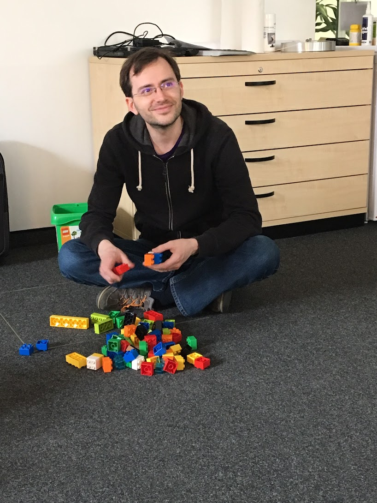

Hi there, you found the online blog of Tobias, a software developer from Germany!

I like to nerd out on tech stuff, develop [open source projects](https://github.com/gesellix), and I love playing Lego with my kids... by the way: I often remember a former colleague saying "Ich werde für meinen Spieltrieb bezahlt" - which translates into "I'm getting paid for my play instinct". And that is what I do for a living :)

Software development has become less technical over time. I'm currently working as an Engineering Manager, so my work is more about people and less about software. Personal projects and freelancing help to stay in touch with code.

Most articles you find on my blog are thoughts about the projects I work on personally in my free time or professionally at my employer. Sometimes you'll learn about my other hobbies, e.g. bicycles or movies.

I'm most active at [GitHub](https://github.com/gesellix) and [X/Twitter](https://twitter.com/gesellix). Feel free to reach out over there!
